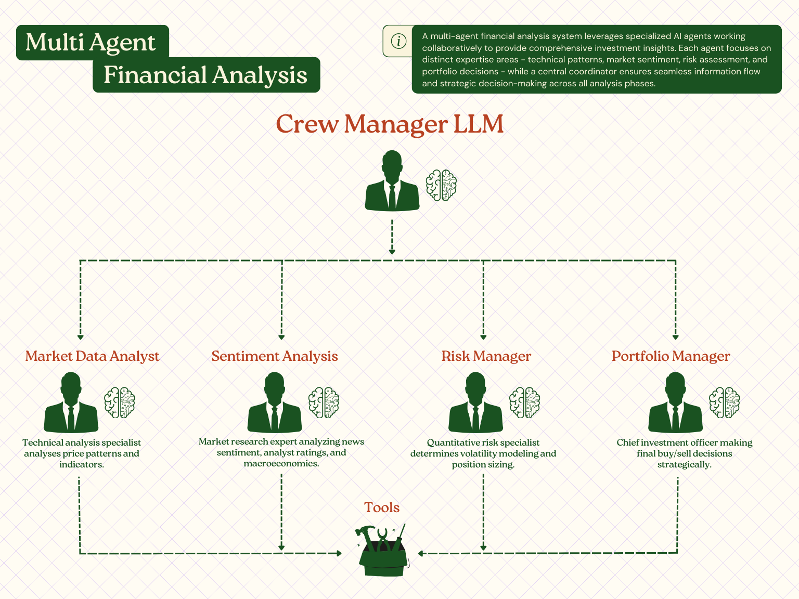

# Agentic Financial Trading & Analysis System

**A multi-agent investment-analysis engine — specialized Claude agents for technical, sentiment, risk, and portfolio decisions, orchestrated with CrewAI.**


</div>

---

## Table of Contents

- [Overview](#overview)
- [Architecture](#architecture)
- [Key Features](#key-features)
- [Agent Specializations](#agent-specializations)
- [Model Assignment](#model-assignment)
- [Analysis Modes](#analysis-modes)
- [Resilience: The Fallback Cascade](#resilience-the-fallback-cascade)
- [Smart Caching](#smart-caching)
- [Quick Start](#quick-start)
- [Requirements](#requirements)
- [Trading Strategies](#trading-strategies)
- [Example Outputs](#example-outputs)
- [Tech Stack](#tech-stack)
- [Scope & Limitations](#scope--limitations)
- [Cost & Performance](#cost--performance)
- [Disclaimer](#disclaimer)
- [License](#license)

---

## Overview

This project explores how a team of specialized AI agents can collaborate on investment analysis. Rather than asking a single model to do everything, the work is split across agents with distinct mandates — one reads price patterns, one gauges market sentiment, one frames risk, and one makes the final call — with each agent's output feeding forward into the next.

It ships in **two flavours**, so you can trade depth for speed:

- **Multi-Agent System** — four specialized agents run in sequence, each building on the last, culminating in a Chief-Investment-Officer decision.
- **Single-Agent System** — one adaptive agent covers the whole workflow, wrapped in a layered fallback chain that degrades gracefully rather than failing outright.

---

## Architecture

<div align="center">
  
</div>

The multi-agent crew is coordinated through CrewAI and runs in **sequential mode**: each agent executes in turn and passes its analysis forward as *context* to the agents downstream. The dependency flow is explicit —

- **Technical** and **Sentiment** run first, independently, from live market data.
- **Risk** builds on the Technical and Sentiment reports.
- **Portfolio (CIO)** synthesizes all three into a final BUY / SELL / HOLD decision.

A Crew Manager LLM is configured for the crew; in the current sequential execution model the ordering and hand-offs are driven by this explicit task-context wiring rather than dynamic delegation between agents.

**Two system options at a glance:**

| System | Composition | Character |
| --- | --- | --- |
| **Multi-Agent** | 4 specialized agents (technical → sentiment → risk → portfolio) | Deeper, layered analysis |
| **Single-Agent** | 1 adaptive agent + multi-tier fallback | Faster, resilient, self-degrading |

---

## Key Features

- 🤝 **Multi-Agent Collaboration** — four specialized agents, each an expert in one facet of the analysis, passing findings forward.
- 📈 **Technical Analysis** — a dozen-plus indicators including RSI, MACD, Bollinger Bands, dual SMAs/EMAs, interval-aware annualized volatility, and volume analysis.
- 📰 **Market Sentiment** — headline-level news scoring (word-boundary matched, per-headline net) alongside analyst-recommendation analysis.
- ⚖️ **Risk Framing** — volatility, correlation, position-sizing and scenario framing tailored to a chosen risk profile.
- ⚡ **Smart Caching** — a fetch-once, slice-many cache with per-component TTLs to minimize redundant data calls.
- 🛡️ **Graceful Degradation** — a four-tier fallback chain (single-agent) so a failure steps down a level instead of stopping.
- 🎯 **Multiple Strategies** — swing, day, value, momentum, and custom user-defined strategies.

---

## Agent Specializations

### 🔍 Market Data Analyst
- **Role:** Senior Technical Analyst
- **Expertise:** Institutional-grade technical analysis with advanced pattern recognition
- **Focus:** Multi-timeframe analysis, support/resistance levels, market structure
- **Tools:** Enhanced financial-data tool (Yahoo Finance), web search

### 📰 Sentiment Analyst
- **Role:** Senior Market Research Analyst
- **Expertise:** Market psychology, fundamental research, macro context
- **Focus:** News sentiment, analyst ratings, catalyst identification
- **Tools:** Sentiment tool, web search, macro-context tool, web scraping

### ⚖️ Risk Manager
- **Role:** Senior Risk Management Director
- **Expertise:** Quantitative framing, stress-scenario thinking, position sizing
- **Focus:** Volatility, correlation, scenario analysis, drawdown framing
- **Tools:** Portfolio-analysis tool, financial-data tool, macro-context tool

### 💼 Portfolio Manager
- **Role:** Chief Investment Officer
- **Expertise:** Strategy integration, capital-allocation decisions
- **Focus:** Final BUY/SELL/HOLD call, sizing, monitoring plan
- **Tools:** Portfolio-analysis tool, financial-data tool

---

## Model Assignment

A deliberate design choice: not every role needs the most powerful (and most expensive) model. Work that is interpretation-heavy gets a strong mid-tier model; the context-aggregation role gets a fast, economical one; the single irreversible decision gets the top tier.

| Agent | Role | Model | Why this tier |
| --- | --- | --- | --- |
| Market Data Analyst | Technical | **Claude Sonnet 5** | Pattern recognition & interpretation |
| Sentiment Analyst | Research | **Claude Sonnet 5** | Nuanced synthesis of noisy text |
| Risk Manager | Risk | **Claude Haiku 4.5** | High-context aggregation, cost-efficient |
| Portfolio Manager | CIO | **Claude Opus 4.8** | The final, highest-stakes decision |

> The single-agent system runs on **Claude Sonnet 5** throughout, varying token budget and tooling by fallback tier rather than swapping models.

---

## Analysis Modes

The multi-agent system supports three depths:

| Mode | Agents involved | Best for |
| --- | --- | --- |
| **Quick** | Technical only | Rapid single-name screening |
| **Smart** *(default)* | Technical + Sentiment + Portfolio | Balanced depth vs. speed |
| **Comprehensive** | All four (adds Risk) | Deep, full-crew analysis |

---

## Resilience: The Fallback Cascade

The single-agent system is built to *survive*, not just to run. If a tier fails, it steps down to a lighter one rather than giving up — each level trading scope and token budget for a higher chance of completing:

```
Comprehensive  ──▶  Quick  ──▶  Minimal  ──▶  Direct-Tool
 (full agent,     (lighter,    (bare-bones,   (skip the LLM,
  all tools)       fewer        one tool)      raw tool output)
                   tools)
```

The multi-agent system has its own escape hatch: if the crew run fails, it falls back to a single comprehensive agent that covers the whole workflow in one pass.

---

## Smart Caching

Market data isn't all equally perishable — a stock's price goes stale in minutes, but its fundamentals barely move in a day. The cache fetches once and slices many times, refreshing each component on its **own** schedule:

| Component | Refresh (TTL) | Rationale |
| --- | --- | --- |
| Price history | 5 minutes | Price-sensitive |
| News | 15 minutes | Headlines drive sentiment |
| Analyst recommendations | 1 hour | Updates trickle in |
| Company fundamentals | 24 hours | Rarely change |

The result: repeated requests for the same ticker reuse cached data intelligently instead of re-hitting the source, while price-sensitive fields stay fresh.

---

## Quick Start

**1. Set up your environment**
```bash
cp .env.example .env
# Edit .env with your API keys (Claude + Serper)
```

**2. Install dependencies**
```bash
pip install -r requirements.txt
```

**3. Run**
```bash
python main.py
```

You'll be prompted to choose a system (multi-agent or single-agent) and an analysis option through an interactive menu.

**Command-line shortcuts:**
```bash
python main.py --check-credits          # verify your Claude account is active
python main.py --single-agent NVDA      # run the single-agent system on a ticker
```

---

## Requirements

- **Claude API key** — [console.anthropic.com](https://console.anthropic.com) (add credits)
- **Serper API key** — [serper.dev](https://serper.dev) (free tier available)
- **Python 3.8+**
- **Yahoo Finance** — no key required (free)

---

## Trading Strategies

| Strategy | Focus | Horizon |
| --- | --- | --- |
| **Swing Trading** | Medium-term trends, support/resistance | 1–6 months |
| **Day Trading** | Short-term momentum, intraday levels | Intraday – 1 week |
| **Value Investing** | Fundamental value, long-term trends | 6 months – 2 years |
| **Momentum** | Trend continuation, breakouts | 2–12 weeks |
| **Custom** | User-defined parameters and focus | Flexible |

---

## Example Outputs

Real analysis examples demonstrating both architectures:

- **Multi-Agent** — [Amazon (AMZN) Comprehensive Analysis](analysis_examples/multi-agent-analysis/AMZN_Analysis.md) — full four-agent collaborative run
- **Single-Agent** — [Tesla (TSLA) Quick Analysis](analysis_examples/single-agent-analysis/TSLA_Analysis.md) — rapid single-agent screening

> *These examples were generated with an earlier version of the code and will be refreshed to reflect the current output format.*

---

## Tech Stack

| Layer | Technology |
| --- | --- |
| **Language** | Python 3.8+ |
| **Agent orchestration** | CrewAI (via LiteLLM) |
| **Reasoning models** | Anthropic Claude — Opus 4.8 / Sonnet 5 / Haiku 4.5 |
| **Market data** | yfinance (Yahoo Finance) |
| **Web search** | Serper |
| **Numerical / analysis** | pandas, NumPy |
| **Config** | python-dotenv |
| **Output** | Markdown reports |

---

## Scope & Limitations

This is a **research prototype** built to explore multi-agent design — capable and complete for that purpose, with some deliberate edges worth knowing before you rely on it:

- **Research-grade, not production.** Intended for exploration and demonstration, not live trading.
- **In-memory cache.** The data cache lives in process memory and resets each run — there is no persistence layer or database.
- **Flat-file output.** Analyses are saved as timestamped Markdown files; there is no results database or dashboard.
- **LLM-reasoned risk metrics.** Figures such as VaR/CVaR in the risk report are produced by the model's reasoning, not independently computed by a quantitative engine — treat them as illustrative rather than audited.
- **Macro context is a placeholder.** The economic-context tool currently returns a structured template of *which* indicators matter rather than live macro data; integrating a source such as FRED or Alpha Vantage is a natural next step.
- **Sequential execution.** Agents run in a fixed order and pass results forward as context; there is no dynamic delegation between agents in the current mode.

Documenting these openly is intentional — they map the honest boundary of a prototype and the roadmap beyond it.

---

## Cost & Performance

Cost depends on the mode and the mix of models a run invokes. As a rough guide:

- **Multi-agent** runs use **Opus 4.8** for the final decision, so they cost more per run and take longer (delays are built in for reliable pacing).
- **Single-agent** runs use **Sonnet 5** throughout and complete faster and cheaper.

For exact usage and billing, check your [Anthropic console](https://console.anthropic.com) — the in-app cost figures are indicative only.

---

## Disclaimer

For **educational and research purposes only.** This is **not financial advice.** Nothing here constitutes a recommendation to buy or sell any security. Consult a qualified financial advisor before making investment decisions.

---

## License

Released under the **MIT License** — see the [LICENSE](LICENSE) file for details.

<div align="center">

---

*Built with CrewAI and Anthropic Claude.*

</div>
